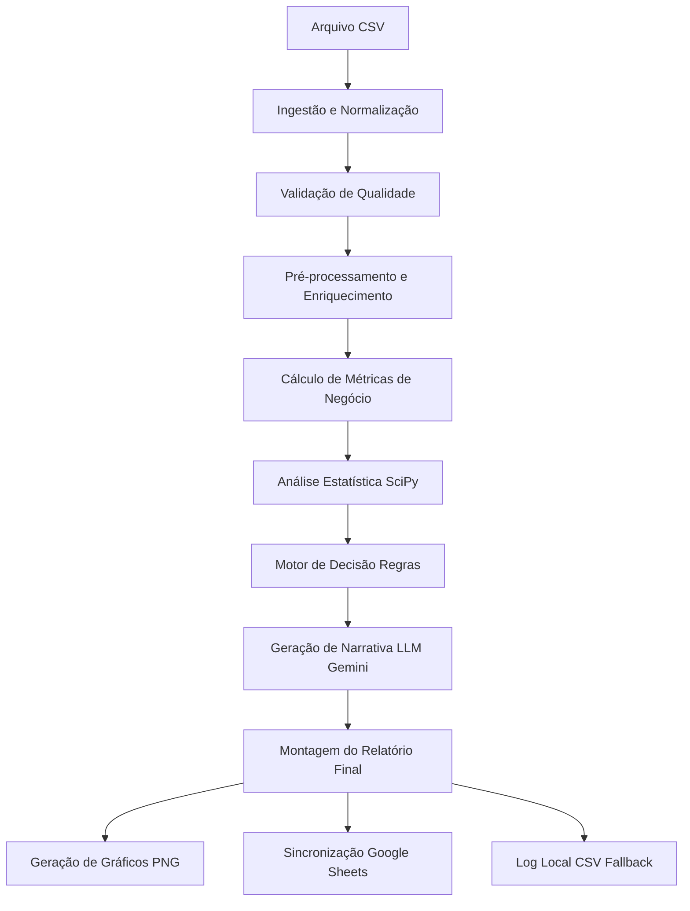
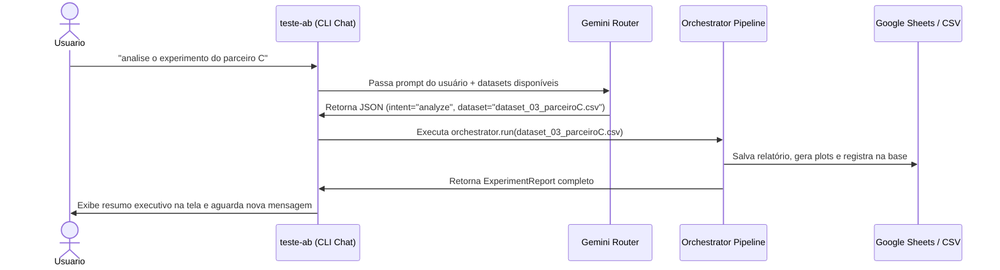
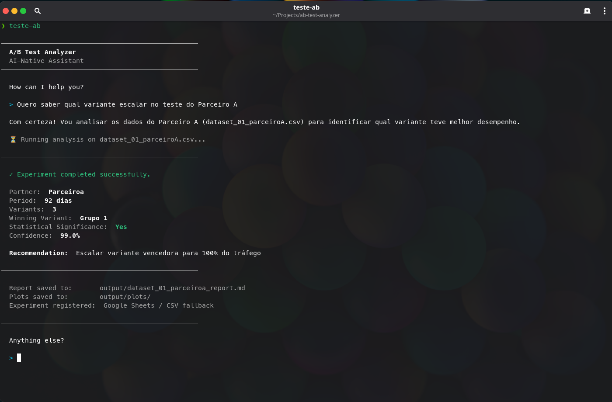
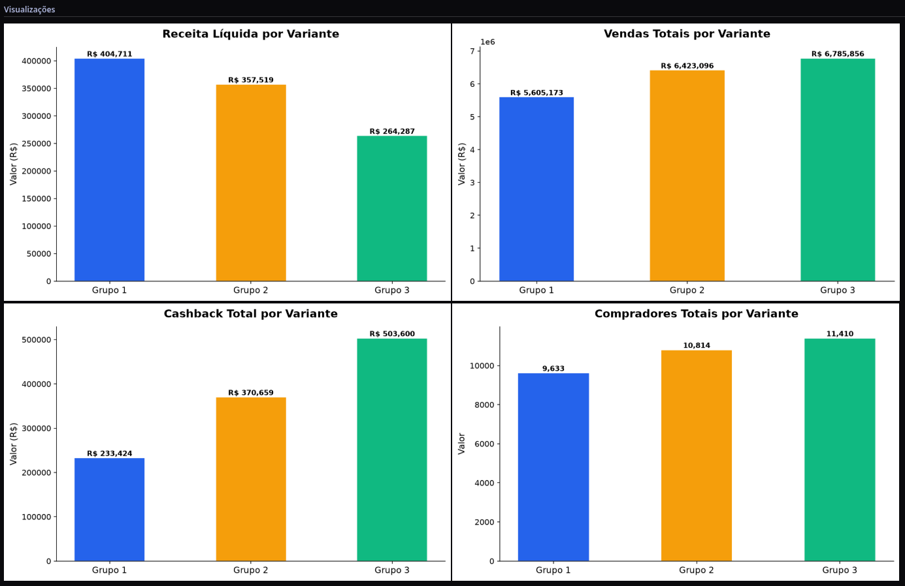

# AB Test Analyzer

[](https://www.python.org/)
[](#🤖-design-ai-native)
[](#-como-executar-os-testes)
[](https://opensource.org/licenses/MIT)

O **AB Test Analyzer** é uma plataforma analítica AI-Native desenvolvida para automatizar de ponta a ponta a análise de experimentos A/B (como testes de cashback) conduzidos por equipes de Growth e Produto. O projeto resolve a necessidade de traduzir grandes volumes de dados brutos transacionais em decisões de negócios acionáveis de forma rápida e precisa. Para isso, combina um núcleo estatístico matemático rígido e totalmente determinístico com uma camada inteligente de conversação e geração de relatórios baseada em Large Language Models (LLM), garantindo que decisões críticas sejam tomadas com base em dados confiáveis e comunicadas de maneira clara para stakeholders técnicos e de negócios.

---

## ✨ Funcionalidades

- **Interface Conversacional AI-Native**: Interação natural por meio de chat inteligente (utilizando Gemini), eliminando a necessidade de comandos rígidos ou conhecimento de nomes de arquivos.
- **Descoberta Inteligente de Datasets**: O assistente descobre e resolve automaticamente o dataset desejado a partir de termos simples como *"parceiro A"*, *"primeiro teste"* ou *"cashback"*.
- **Resolução de Ambiguidades**: Fluxo iterativo inteligente que solicita esclarecimentos por chat caso múltiplos datasets atendam aos critérios do usuário.
- **Memória de Sessão de Longo Prazo**: Capacidade do assistente de recordar análises anteriores na mesma sessão, permitindo comparar resultados ou referenciar execuções passadas (ex: *"analise o segundo agora"*, *"compare o resultado atual com o anterior"*).
- **Validação e Normalização de Dados**: Verificação detalhada de integridade, incluindo ausência de colunas, múltiplos parceiros, valores nulos, inconsistências temporais e valores negativos.
- **Cálculo Determinístico de Métricas**: Computação precisa de GMV, Compradores, Comissão, Cashback, Receita Líquida e Margem Líquida.
- **Análise Estatística Avançada**: Testes de hipóteses customizados (Shapiro-Wilk, Teste T, ANOVA, Bonferroni) com avaliação de p-valor, significância estatística e tamanho do efeito (Cohen's d).
- **Relatório Executivo Automatizado**: Geração de relatório detalhado em Markdown e geração de gráficos de variantes (salvos localmente) aliados a uma narrativa executiva gerada por IA.
- **Registro em Planilhas**: Sincronização automática com planilha do Google Sheets, contando com persistência local em CSV de contingência caso as credenciais estejam ausentes.

---

## 📐 Arquitetura

O sistema é baseado em um fluxo de pipeline sequencial desacoplado. O cálculo matemático e estatístico é estritamente isolado da camada de IA, assegurando a reprodutibilidade dos resultados numéricos.



Para uma análise técnica aprofundada de cada componente da pipeline e suas responsabilidades, consulte o [ARCHITECTURE.md](file:///home/adiel/Projects/ab-test-analyzer/ARCHITECTURE.md).

---

## 📂 Estrutura do Projeto

```text
ab-test-analyzer/
├── src/
│   ├── core/                        # Núcleo matemático e estatístico (sem LLM)
│   │   ├── ingestion/               # Leitura e carregamento de arquivos CSV
│   │   ├── normalization/           # Limpeza e padronização inicial dos dados
│   │   ├── validation/              # Validação de integridade e regras sanitárias
│   │   ├── preprocessing/           # Cálculos de colunas derivadas e conversão monetária
│   │   ├── metrics/                 # Consolidação de indicadores financeiros do negócio
│   │   ├── statistics/              # Testes estatísticos de hipóteses e distribuições
│   │   └── decision/                # Motor de regras determinísticas de negócio
│   │
│   ├── integrations/                # Conexões com serviços externos
│   │   └── google_sheets/           # Serviço de escrita e registro no Google Sheets
│   │
│   ├── llm/                         # Integração e prompts para geração de relatórios (Gemini)
│   ├── reporting/                   # Serviço de geração e salvamento de relatórios e plots
│   │
│   ├── ai_interface.py              # Interface programática e schemas para ferramentas externas
│   ├── cli_chat.py                  # CLI do Assistente Conversacional (teste-ab)
│   ├── config.py                    # Configuração centralizada e variáveis de ambiente
│   ├── constants.py                 # Constantes físicas, caminhos e limites estatísticos
│   ├── exceptions.py                # Exceções customizadas da aplicação
│   ├── logging_config.py            # Estrutura de logs do console
│   ├── main.py                      # Ponto de entrada CLI tradicional (modo determinístico)
│   └── models.py                    # Contratos de dados compartilhados (Dataclasses)
│
├── tests/                           # Suíte de testes unitários e de integração (Pytest)
├── input/                           # Diretório sugerido para datasets de entrada
├── output/                          # Diretório onde relatórios e gráficos são gerados
├── AGENT.md                         # Instruções de setup para agentes externos de IA
├── pyproject.toml                   # Dependências e definição do pacote Python
└── ARCHITECTURE.md                  # Documentação de arquitetura detalhada
```

---

## 🛠️ Instalação

### Pré-requisitos
- Python **3.12 ou superior** instalado.

### 1. Clonar e Acessar o Repositório
```bash
git clone <url-do-repositorio>
cd ab-test-analyzer
```

### 2. Configurar o Ambiente Virtual
No Linux/macOS:
```bash
python3 -m venv .venv
source .venv/bin/activate
```
No Windows:
```cmd
python -m venv .venv
.venv\Scripts\activate
```

### 3. Instalar Dependências
Para instalar apenas os pacotes de execução básica:
```bash
pip install -e .
```
Para instalar pacotes de desenvolvimento (inclui `pytest`, `ruff`):
```bash
pip install -e ".[dev]"
```

---

## 🏃 Como Executar o Projeto

Você tem 3 opções de execução dependendo da sua necessidade (teste local, execução completa com IA ou interface conversacional).

---

### Opção 1: Modo Local Determinístico (Sem Chaves de API)

Ideal para desenvolvimento rápido, testes em ambientes offline, CI/CD ou reprodutibilidade numérica. **Nenhuma chave de API ou credencial é necessária.**

O motor estatístico rodará localmente, a planilha consolidará no CSV local e a narrativa textual do relatório será construída com base em regras estáticas locais.

```bash
python -m src.main <caminho_do_csv> <nome_do_experimento> <nome_do_parceiro>
```

#### Exemplo Prático:
```bash
python -m src.main input/dataset_01_parceiroA.csv "Campanha de Growth A" "Parceiro A"
```

---

### Opção 2: Modo IA Completo (LLM + Google Sheets)

Executa a pipeline completa: calcula as estatísticas de forma determinística, usa o Google Gemini para redigir a narrativa executiva de negócios e publica os resultados em tempo real no Google Sheets.

#### Requisitos
1. Crie o arquivo `.env` na raiz do projeto a partir do [.env.example](file:///home/adiel/Projects/ab-test-analyzer/.env.example) e configure sua chave de API do Gemini:
   ```bash
   cp .env.example .env
   ```
   No seu `.env`:
   ```env
   LLM_API_KEY=sua_chave_do_gemini
   ```
2. Adicione o arquivo de credenciais da conta de serviço do Google Cloud com o nome `credentials.json` na raiz do projeto.
3. Compartilhe a planilha alvo com o e-mail da conta de serviço.

Execute a análise passando os parâmetros necessários:
```bash
python -m src.main input/dataset_01_parceiroA.csv "Campanha de Growth A" "Parceiro A"
```

---

### Opção 3: CLI Conversacional AI-Native (Recomendado)

Inicie um assistente interativo por chat onde você pode solicitar análises de forma totalmente livre e natural.

#### Como Iniciar:
```bash
teste-ab
```

#### Exemplo de Interação Real no Terminal:
```text
$ teste-ab

──────────────────────────────────────────────────
  A/B Test Analyzer
  AI-Native Assistant
──────────────────────────────────────────────────

  How can I help you?

  > analise o primeiro experimento

  ⏳ Running analysis on dataset_01_parceiroA.csv...

──────────────────────────────────────────────────

  ✓ Experiment completed successfully.

  Partner:  Parceiro A
  Period:   30 dias
  Variants: 3
  Winning Variant: Grupo 2
  Statistical Significance: Yes
  Confidence: 95.0%

  Recommendation: Escalar variante vencedora para 100% do tráfego

──────────────────────────────────────────────────

  Report saved to:       output/dataset_01_parceiroa_report.md
  Plots saved to:        output/plots/
  Experiment registered: Google Sheets / CSV fallback

──────────────────────────────────────────────────

  Anything else?

  > agora rode a analise para o parceiro B

  ⏳ Running analysis on dataset_02_parceiroB.csv...
  ...
```

---

## ⚙️ Configuração

A tabela a seguir apresenta os parâmetros que podem ser configurados via variáveis de ambiente ou arquivos na raiz:

| Variável / Arquivo | Tipo | Obrigatório | Descrição |
|---|---|---|---|
| `LLM_API_KEY` | Var. de Ambiente | Não | Chave de API para acesso ao Google Gemini. Se ausente, ativa o relatório determinístico local. |
| `credentials.json` | Arquivo | Não | Credenciais de conta de serviço Google Cloud. Se ausente, os resultados serão registrados localmente no CSV. |
| `spreadsheet_id` | Config (`src/config.py`) | Não | ID da planilha Google Sheets onde os experimentos serão cadastrados. |

---

## 🛡️ Comportamento Sem Credenciais (Modo Graceful Degradation)

O **AB Test Analyzer** foi desenhado com tolerância a falhas e independência de ambiente. Se você não possuir credenciais externas, a aplicação adapta seu fluxo de forma transparente para que **nenhuma capacidade analítica seja perdida**:

- **Sem chave Gemini (`LLM_API_KEY`):** Os cálculos estatísticos e decisões estatísticas ocorrem perfeitamente. O relatório em Markdown é criado com uma narrativa de negócios determinística estruturada localmente (fallback).
- **Sem Google Sheets (`credentials.json`):** A gravação de experimentos não falha. O sistema cria automaticamente um arquivo local estruturado em `output/experiment_log.csv` e passa a registrar os logs de cada teste nele.

---

## 📊 Outputs Gerados

Após cada execução, o sistema salva os seguintes artefatos na pasta `output/`:

- **Relatórios markdown (`output/<nome_do_experimento>_report.md`)**: Relatórios executivos completos traduzidos em português de negócios, incluindo as tabelas de métricas, p-valores, testes estatísticos de hipóteses e narrativa gerada por IA.
- **Gráficos e Visualizações (`output/plots/`)**: Gráficos de barra no formato PNG comparando GMV, Receita Líquiva, Comissão e Compradores das variantes para apoio na tomada de decisão.
- **Logs Consolidados (`output/experiment_log.csv`)**: O log de registro local (quando não enviado para a planilha do Google) consolidando o histórico de todos os experimentos.

---

## 🔄 Fluxo de Exemplo



---

## 🧪 Como Executar os Testes

O projeto possui mais de 40 testes de unidade cobrindo ingestion, validação de regras de negócios, cálculos de margens, testes estatísticos e motores de decisão.

Para executar todos os testes locais de forma automatizada:
```bash
pytest
```
Para obter detalhes de saída verbosa com logs:
```bash
pytest -v
```

---

## 🤖 Design AI-Native

O projeto segue a filosofia **AI-Native** pura:
- **Núcleo Confiável e Determinístico**: A IA não faz contas ou testes estatísticos. Todo cálculo financeiro e de p-valor é executado de forma determinística em Python (`pandas`, `scipy`).
- **IA focada em Comunicação**: O LLM atua onde brilha: traduzindo estatísticas complexas em narrativas executivas e resolvendo intenções em linguagem natural na interface CLI.
- **Pipelines Reutilizáveis**: A mesma pipeline gerencia qualquer dataset de A/B no padrão aceito sem requerer modificações no código da infraestrutura.

---

## 💻 Tecnologias Utilizadas

- **Linguagem Principal**: Python >= 3.12
- **Análise Estatística**: SciPy (módulos shapiro, ttest_ind, f_oneway)
- **Manipulação de Dados**: Pandas
- **Geração de Gráficos**: Matplotlib
- **Orquestração e IA**: SDK Oficial `google-genai` (Modelo: `gemini-3.1-flash-lite`)
- **Planilhas**: GSpread e Google Auth Library
- **Suíte de Testes**: Pytest

---

## 🔮 Melhorias Futuras

- Integração direta com bancos de dados relacionais e data warehouses (ex: BigQuery, PostgreSQL) para ingestão automatizada.
- Suporte a testes sequenciais com correção de parada antecipada (correções de alpha spending).
- Upload automático do relatório Markdown gerado para plataformas de documentação corporativa (ex: Notion, Confluence).

---

## 📸 Screenshots

### Tela do Assistente Conversacional (`teste-ab`)

### Gráfico de Variante Gerado


---
